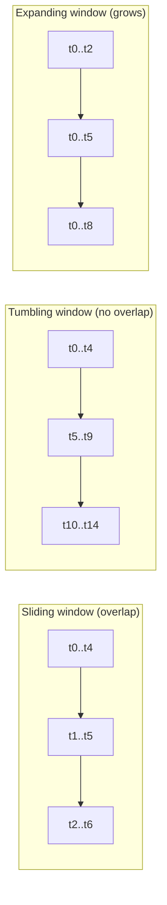
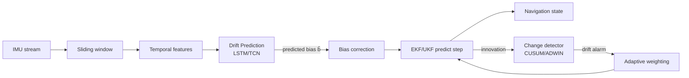
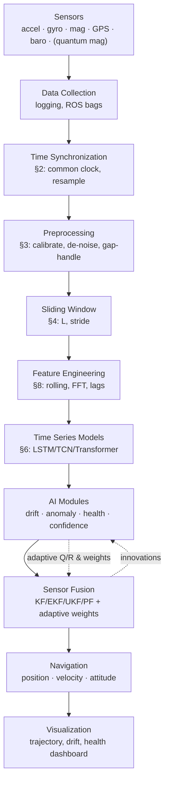

# Phase 4 — Time Series Analysis for Trinetra-AI

**Trinetra-AI: An Intelligent Multi-Sensor Fusion Framework for GPS-Denied Navigation**
Research-grade study notes · Time series through the lens of intelligent sensor fusion and navigation.

> **How to read this document.** Every concept is introduced with beginner intuition first, then the mathematics, then a *sensor-specific* example tied to the accelerometer / gyroscope / magnetometer / IMU / GPS / barometer (and, where relevant, a future quantum magnetometer). The recurring question throughout is not "what is this time-series idea?" but "**where does it live inside the Trinetra-AI pipeline?**"

---

## Table of Contents

1. [Introduction](#1--introduction)
2. [Time Series Fundamentals](#2--time-series-fundamentals)
3. [Sensor Time Series](#3--sensor-time-series)
4. [Sliding Window](#4--sliding-window)
5. [Time Series Forecasting](#5--time-series-forecasting)
6. [Sequence Modeling](#6--sequence-modeling)
7. [Drift Detection](#7--drift-detection)
8. [Temporal Feature Engineering](#8--temporal-feature-engineering)
9. [Time Series Datasets](#9--time-series-datasets)
10. [Libraries](#10--libraries)
11. [Research Papers](#11--research-papers)
12. [Project Integration](#12--project-integration)
13. [Interview Preparation](#13--interview-preparation)
14. [Practical Implementation](#14--practical-implementation)
15. [Summary, Glossary & Roadmap to Phase 5](#15--summary-glossary--roadmap)

---

## 1 · Introduction

### 1.1 What is a time series?

A **time series** is a sequence of observations indexed by time:

$$X = \{x_{t_1}, x_{t_2}, \dots, x_{t_N}\}, \qquad t_1 < t_2 < \dots < t_N.$$

Each $x_t$ may be a scalar (barometric pressure) or a vector (a 3-axis accelerometer reading $\mathbf{x}_t = [a_x, a_y, a_z]^\mathsf{T}$). The defining property is that **order matters**: shuffling the samples destroys the information. This is the single fact that separates time-series analysis from ordinary tabular machine learning, where rows are assumed exchangeable.

**Intuition.** A photograph tells you a state; a video tells you a *story*. Sensor data is a video: the meaning of "the accelerometer reads 9.8 m/s²" depends entirely on what came just before it (were we stationary, or at the top of a parabolic jump?).

### 1.2 Why sensor data is inherently sequential

A navigation state evolves according to physics — a differential equation $\dot{\mathbf{x}} = f(\mathbf{x}, \mathbf{u})$. Position is the integral of velocity; velocity is the integral of acceleration. Because each state depends on the previous one, the sensor stream that *observes* that state is sequential by construction. You literally cannot compute displacement from a single accelerometer sample — you must integrate a *sequence*.

### 1.3 Why time series is critical in robotics

Robots close a **perception → estimation → control** loop dozens to hundreds of times per second. Every block in that loop consumes time series: raw sensor streams in, filtered state estimates out, control commands as a function of the recent past. Latency, sample-rate mismatch, and temporal misalignment are first-class engineering concerns, not afterthoughts.

### 1.4 Why navigation systems depend on time series

Inertial navigation is *dead reckoning*: integrate motion over time from a known start. Formally, strapdown mechanization integrates the IMU:

$$\mathbf{v}_t = \mathbf{v}_0 + \int_0^t (\mathbf{R}(\tau)\,\mathbf{a}^{\text{body}}(\tau) - \mathbf{g})\, d\tau, \qquad \mathbf{p}_t = \mathbf{p}_0 + \int_0^t \mathbf{v}(\tau)\, d\tau.$$

The double integral is why small errors compound: a constant accelerometer bias $b$ produces a position error growing as $\tfrac{1}{2} b t^2$. Understanding the *temporal* structure of error is the entire game.

### 1.5 Time series in GPS-denied navigation

When GPS drops (indoors, underground, urban canyons, jamming), the system has no absolute position fix and must rely on the temporal evolution of inertial + magnetic + barometric data, corrected by any available aiding (magnetic-map matching, terrain features). The core challenge is **unbounded drift over time**, and every time-series tool in this document exists to bound or predict that drift.

### 1.6 Time series in quantum navigation

Quantum sensors (e.g. optically-pumped or NV-diamond magnetometers, cold-atom accelerometers) promise dramatically lower drift and higher sensitivity. But from the software layer's perspective they are **still time series** — higher-quality ones. A quantum magnetometer produces a cleaner magnetic-field stream $\mathbf{m}_t$ that can be matched against a crustal-anomaly map for drift-free positioning. Trinetra-AI treats such a sensor as a future channel that plugs into the same windowing, feature-extraction, and fusion machinery.

### 1.7 Time series in sensor fusion

Fusion is the act of combining several *time-aligned* streams into one state estimate that is better than any single sensor. The Kalman family does this recursively, one timestep at a time — an inherently temporal operation (predict forward in time, update with the current measurement).

### 1.8–1.10 Autonomous vehicles, UAVs, and space navigation

| Domain | Temporal challenge | Trinetra-AI relevance |
|---|---|---|
| **Autonomous vehicles** | GNSS multipath in cities; high dynamics | Fuse IMU+wheel+map; predict short GPS outages |
| **UAVs / drones** | Vibration, fast rotation, GPS loss under bridges/indoors | High-rate gyro handling; drift-aware fusion |
| **Space navigation** | No GPS beyond MEO; long integration times | Extreme drift discipline; star/magnetic aiding analogues |

> **Takeaway for Trinetra-AI.** Time series is not one phase among many — it is the *substrate* the whole project runs on. Filters, ML modules, and evaluation all operate on windows of temporally-ordered sensor data.

---

## 2 · Time Series Fundamentals

Rather than repeat a nine-field template fifteen times, this section groups the fundamentals into three clusters — **temporal structure**, **signal components**, and **stationarity** — giving each concept a definition, the math, the sensor meaning, and (where useful) code. A consolidated reference table follows.

### 2.1 Temporal structure

**Time index / timestamp.** The label $t_i$ attached to each sample. In practice a timestamp is an absolute clock value (e.g. Unix nanoseconds); the *time index* is its position in the sequence. Ambiguity between these two causes real bugs.

**Sampling rate & frequency.** The sampling frequency $f_s$ (Hz) is the number of samples per second; the sampling period is $T_s = 1/f_s$. A gyroscope at $f_s = 200\text{ Hz}$ delivers a sample every $5$ ms.

**Time resolution.** The smallest time difference the system can distinguish — bounded above by $T_s$. Fusing a $200$ Hz IMU with a $1$ Hz GPS means the GPS resolution is $200\times$ coarser.

**Nyquist limit.** To represent a signal component at frequency $f$ without aliasing you need $f_s > 2f$. Vibrations above $f_s/2$ fold back into your band as spurious low-frequency content — a classic source of phantom "drift."

**Time synchronization.** Different sensors run on different clocks at different rates. Aligning them to a common timeline (interpolation, hardware timestamping, or timestamp offset estimation) is a prerequisite for fusion. **This is the single most common cause of a fusion system silently failing.**

**Temporal dependency (autocorrelation).** The degree to which $x_t$ depends on $x_{t-k}$. Quantified by the autocorrelation function

$$\rho(k) = \frac{\mathbb{E}[(x_t - \mu)(x_{t-k} - \mu)]}{\sigma^2}.$$

Sensor signals are highly autocorrelated at short lags (physics is smooth); white noise is not.

### 2.2 Signal components

Classical decomposition views a series as

$$x_t = \underbrace{T_t}_{\text{trend}} + \underbrace{S_t}_{\text{seasonal}} + \underbrace{C_t}_{\text{cyclic}} + \underbrace{\varepsilon_t}_{\text{noise}} \quad(\text{additive}),$$

or multiplicatively $x_t = T_t \cdot S_t \cdot \varepsilon_t$.

- **Trend** $T_t$ — slow monotone change. *Sensor meaning:* gyroscope **bias drift**, or barometric pressure falling as a drone climbs.
- **Seasonality** $S_t$ — a fixed-period pattern. *Sensor meaning:* magnetometer distortion that repeats each time a wheeled robot completes a loop; thermal cycling of a MEMS bias with a duty cycle.
- **Cyclic** $C_t$ — repetition without a fixed period. *Sensor meaning:* gait cycles in pedestrian IMU data (period varies with walking speed).
- **Noise** $\varepsilon_t$ — the irreducible random part (see §3 for the white-noise / random-walk breakdown).
- **Outliers** — individual samples far from their neighbours: a GPS multipath jump, a magnetometer spike near a motor.
- **Missing values** — dropped packets, GPS loss. Handled by interpolation, masking, or model-based imputation.

### 2.3 Stationarity

A series is **strictly stationary** if its full joint distribution is time-invariant; **weakly (covariance) stationary** if mean, variance, and autocovariance $\gamma(k)$ do not depend on $t$:

$$\mathbb{E}[x_t] = \mu, \quad \operatorname{Var}(x_t) = \sigma^2, \quad \operatorname{Cov}(x_t, x_{t+k}) = \gamma(k)\ \forall t.$$

Raw navigation signals are almost always **non-stationary** (a moving vehicle's acceleration statistics change constantly). Two consequences: (1) many classical models (ARIMA) assume stationarity and require differencing first; (2) *drift itself is a non-stationarity* — detecting it (§7) is detecting a change in the signal's statistics.

```python
# Quick stationarity check (Augmented Dickey-Fuller)
from statsmodels.tsa.stattools import adfuller
stat, pvalue, *_ = adfuller(gyro_z)          # gyro_z: 1-D numpy array
print("stationary" if pvalue < 0.05 else "non-stationary (differencing/detrend needed)")
```

### 2.4 Consolidated reference

| Concept | Math / symbol | Sensor example | Why it matters in Trinetra-AI | Limitation to watch |
|---|---|---|---|---|
| Sampling freq. $f_s$ | $T_s=1/f_s$ | IMU 200 Hz, GPS 1 Hz | Sets window sizes & fusion cadence | Aliasing above $f_s/2$ |
| Time sync | $t_i^A \leftrightarrow t_j^B$ | IMU vs GPS clocks | Misalignment = biased fusion | Sub-ms errors matter at high dynamics |
| Autocorrelation | $\rho(k)$ | Smooth accel vs white noise | Feature for health/drift | Long-lag structure hard to capture |
| Trend | $T_t$ | Gyro bias drift | Target of drift-prediction module | Confounds with real motion |
| Seasonality | $S_t$ | Loop-closure magnetic pattern | Map-matching cue | Period must be known/estimated |
| Outlier | robust z-score | GPS multipath jump | Anomaly/fault detection | Hard to separate from maneuvers |
| Missing values | mask / impute | GPS dropout | Triggers GPS-denied mode | Naive interpolation hides gaps |
| Stationarity | ADF test | Static vs moving IMU | Model choice; drift = non-stationarity | Real signals rarely stationary |

**Interview prompts (fundamentals).** *Why does a constant accelerometer bias cause quadratic position error? What is aliasing and how does it masquerade as drift? Why is time synchronization harder than it looks when fusing 200 Hz IMU with 1 Hz GPS?*

---

## 3 · Sensor Time Series

Each sensor is a time series with its own units, rate, and error signature. Understanding these signatures is what lets you set the filter's noise matrices $\mathbf{Q}, \mathbf{R}$ honestly (this connects directly to Phase 1 statistics and Phase 5 signal processing).

### 3.1 The universal sensor error model

Every real sensor output can be modeled as

$$z_t = \underbrace{s_t}_{\text{true signal}} + \underbrace{b_t}_{\text{bias}} + \underbrace{k\, s_t}_{\text{scale error}} + \underbrace{n_t}_{\text{white noise}} + \underbrace{w_t}_{\text{random walk}},$$

where the **bias** $b_t$ drifts slowly, **white noise** $n_t$ is zero-mean and uncorrelated, and the **random walk** $w_t = \int n\, d\tau$ has variance growing linearly in time. The **Allan variance** (Phase 5) separates these components from a long static recording and is the standard way to quote $\mathbf{Q}, \mathbf{R}$.

### 3.2 Per-sensor summary

| Sensor | Measures | Typical units | Typical rate | Dominant errors | Characteristic graph |
|---|---|---|---|---|---|
| **Accelerometer** | specific force $[a_x,a_y,a_z]$ (incl. gravity) | m/s² or $g$ | 100–1000 Hz | bias, vibration noise, scale | flat ≈ $g$ on one axis at rest; spikes on impact |
| **Gyroscope** | angular velocity $[\omega_x,\omega_y,\omega_z]$ | rad/s or °/s | 100–1000 Hz | **bias drift** (dominant), ARW | ≈0 at rest but slowly wandering |
| **Magnetometer** | magnetic field $[m_x,m_y,m_z]$ | µT or Gauss | 10–100 Hz | hard/soft-iron, spikes near motors | sinusoidal in $x$–$y$ as you rotate |
| **GPS/GNSS** | lat, lon, alt (+ velocity) | deg, m | 1–10 Hz | multipath, dropouts, low rate | piecewise-smooth, occasional jumps |
| **Barometer** | pressure → altitude | hPa, m | 10–100 Hz | slow weather drift, temp sensitivity | smooth, tracks vertical motion |
| **IMU (combined)** | accel + gyro (+mag = MARG) | — | 100–1000 Hz | integrated drift | see accel+gyro |
| **Quantum magnetometer** *(future)* | scalar/vector field | nT | 10–1000 Hz | far lower drift; heading errors | near-drift-free field trace |

### 3.3 Reading the signatures

**Accelerometer.** At rest, the vector magnitude equals gravity ($\approx 9.81$ m/s²) and points "up" in the body frame — this is what lets you estimate roll/pitch (but *not* yaw). During motion, gravity and true acceleration are entangled and must be separated using orientation, which is why accel-only position is hopeless without the gyro.

**Gyroscope.** The workhorse for orientation, but its bias drift is the arch-enemy: integrating a small constant bias gives a linearly growing heading error, which then leaks into position through the rotation matrix. Predicting this bias is a headline Trinetra-AI ML module (§7).

**Magnetometer.** Gives an absolute heading reference (a compass) that *does not drift* — the perfect complement to the gyro. But it is corrupted by **hard-iron** (permanent magnets, additive offset) and **soft-iron** (ferromagnetic material, ellipsoidal distortion) effects that require calibration:

$$\mathbf{m}_{\text{cal}} = \mathbf{A}^{-1}(\mathbf{m}_{\text{raw}} - \mathbf{b}),$$

with $\mathbf{b}$ the hard-iron offset and $\mathbf{A}$ the soft-iron matrix. Crucially, indoor magnetic *anomalies* are not just noise — they are a **map** you can localize against (magnetic SLAM).

**GPS.** Absolute, drift-free, but low-rate, unavailable indoors, and prone to multipath jumps. In Trinetra-AI it is the "truth when present, absent otherwise" channel that defines the GPS-denied problem.

**Barometer.** Nearly decoupled from horizontal motion, it constrains the notoriously weak vertical (z) axis of inertial navigation.

### 3.4 Preprocessing checklist (all sensors)

1. **Timestamp & synchronize** to a common clock/rate (interpolate the slow channels).
2. **Calibrate** (accel/gyro bias & scale; magnetometer hard/soft-iron).
3. **De-noise** (Phase 5: low-pass, moving average, Savitzky–Golay) — *without* eating real dynamics.
4. **Handle gaps** (mask GPS dropouts; do not silently interpolate across long outages).
5. **Normalize / standardize** per channel before feeding ML models.

```python
import numpy as np, pandas as pd

def resample_to(df, rate_hz, cols):
    """Resample an irregular timestamped sensor frame onto a uniform grid."""
    t0, t1 = df['t'].iloc[0], df['t'].iloc[-1]
    grid = np.arange(t0, t1, 1.0/rate_hz)
    out = {'t': grid}
    for c in cols:
        out[c] = np.interp(grid, df['t'].values, df[c].values)
    return pd.DataFrame(out)
```

**Real datasets to practice on:** OxIOD, RoNIN, MagPIE/MagPIE2, EuRoC MAV, KITTI, TUM VI, comma2k19 — all catalogued in §9.

---

## 4 · Sliding Window

Deep models do not consume an infinite stream; they consume fixed-length **windows**. Choosing the windowing strategy is one of the highest-leverage design decisions in the project.

### 4.1 The five window types



| Type | Definition | Overlap | Typical use in Trinetra-AI |
|---|---|---|---|
| **Fixed** | constant length $L$ | — | baseline window size for all models |
| **Sliding (rolling)** | window of length $L$ advanced by stride $s < L$ | yes | training samples for LSTM/TCN drift & displacement models |
| **Tumbling** | sliding with stride $s = L$ | none | non-overlapping feature blocks, streaming stats |
| **Expanding** | start fixed, end grows | full | online estimators that accumulate history |
| **Rolling** | synonym for sliding in most libraries (pandas `.rolling`) | yes | rolling mean/std features (§8) |

Two parameters define everything: **window length** $L$ (how much context) and **stride** $s$ (how much you advance). Overlap fraction is $1 - s/L$.

### 4.2 Why windows are required

- Neural nets need fixed-size inputs; a raw stream has none.
- A window carries the **temporal context** a single sample lacks (you cannot see "drift" in one sample).
- Overlap multiplies the number of training examples and smooths predictions.
- Window length must exceed the timescale of the phenomenon: to see a gait cycle (~1 s) at 100 Hz you need $L \gtrsim 100$.

### 4.3 How the models consume windows

- **LSTM/GRU** ingest the window as an ordered sequence, updating a hidden state step by step — natural for streaming, $O(L)$ per window.
- **TCN** applies dilated causal convolutions across the window in parallel — fast, with a receptive field set by dilation depth.
- **Transformer** attends over all $L$ positions simultaneously via self-attention — captures long-range dependencies but costs $O(L^2)$.

### 4.4 Implementation

```python
import numpy as np

def make_windows(x, L, stride=1, horizon=1):
    """
    x: (T, C) sensor array. Returns X:(N,L,C) windows and y:(N,C) next-step targets.
    """
    X, y = [], []
    for start in range(0, len(x) - L - horizon + 1, stride):
        X.append(x[start:start+L])
        y.append(x[start+L+horizon-1])          # 1-step (or h-step) ahead target
    return np.asarray(X), np.asarray(y)

# Example: 1 s of 100 Hz IMU context predicting the next sample
X, y = make_windows(imu_6axis, L=100, stride=10, horizon=1)
```

**Navigation examples.** A 200-sample IMU window → predicted 3D displacement (the RoNIN/TLIO recipe). A window of magnetometer + position → matched against a magnetic map. A window of GPS residuals → anomaly/spoofing detector.

**Advantages / disadvantages.** Overlapping windows give more data and smoother output but introduce correlation between train/val samples (**leakage** — split by *trajectory/time*, never randomly). Long windows capture more context but raise latency and (for Transformers) quadratic cost.

> **Design rule.** Choose $L$ from the physics (longest relevant timescale), choose stride from your latency/throughput budget, and **always split train/test by trajectory or time**, not by shuffled windows.

---

## 5 · Time Series Forecasting

**Forecasting** predicts future values $x_{t+1}, \dots, x_{t+h}$ from the past $x_{\le t}$. In Trinetra-AI, forecasting is not an end in itself — it is the mechanism for **anticipating drift, bridging GPS outages, and flagging faults before they corrupt the state**.

### 5.1 One-step vs multi-step

- **One-step:** predict $x_{t+1}$ only. Learns $f_\theta(x_{t-L+1:t}) \to \hat{x}_{t+1}$.
- **Multi-step (horizon $h$):** predict $x_{t+1:t+h}$. Two strategies:
  - **Recursive:** predict one step, feed it back as input, repeat. Simple, but errors compound over the horizon.
  - **Direct:** train $h$ separate models (or one multi-output head) for each lead time. No error accumulation, but more parameters and no cross-step consistency.
  - **Seq2seq (encoder–decoder):** an encoder summarizes the past into a context; a decoder emits the whole horizon. This is what modern LSTM/Transformer forecasters use.

$$
\text{recursive: } \hat{x}_{t+k} = f_\theta(\dots, \hat{x}_{t+k-1}); \qquad
\text{direct: } \hat{x}_{t+k} = f_\theta^{(k)}(x_{t-L+1:t}).
$$

**Forecast horizon** $h$ is the number of steps ahead. Longer $h$ ⇒ higher uncertainty; report error as a function of $h$.

**Teacher forcing.** During training of a seq2seq/RNN decoder, feed the *ground-truth* previous value instead of the model's own prediction. It speeds convergence but creates **exposure bias** (train/test mismatch), mitigated by scheduled sampling (gradually replace ground truth with predictions).

### 5.2 What Trinetra-AI can forecast — and why

| Target | Forecastable? | Why it matters | Caveat |
|---|---|---|---|
| **Sensor drift / bias** | **Yes** — slow, structured | Pre-correct the gyro/accel bias before it corrupts integration | Must not absorb real motion |
| **Position** | Short horizon only | Bridge brief GPS outages (dead-reckon assist) | Diverges fast under GPS-denial without aiding |
| **Velocity** | Yes (short) | Smooths estimates, gates outliers | Depends on maneuver predictability |
| **Orientation** | Short horizon | Anticipate heading for control | Yaw weakly observable without mag |
| **Magnetic field** | Only *given a map + position* | Map-matching residuals | Field is spatial, not purely temporal |
| **Sensor failure** | Yes (as classification/anomaly) | Switch to redundant sensor early | Rare-event, class imbalance |

> **Key insight.** *Drift is the ideal forecasting target* because it is smooth and low-frequency — exactly the regime where sequence models excel. *Raw position is a poor pure-forecasting target* under GPS-denial because it lacks an absolute anchor; that is a job for the fusion filter, not a standalone forecaster.

### 5.3 Where forecasting plugs into the pipeline

The **Drift Prediction** module (an LSTM/TCN) forecasts the next-window gyro/accel bias and subtracts it *before* the Kalman predict step, shrinking the effective process noise. The **Anomaly** module forecasts the expected next measurement; a large forecast residual (in Mahalanobis distance) flags a fault. Both feed the **Adaptive Weighting** module, which down-weights a sensor whose forecasts are becoming unreliable.

---

## 6 · Sequence Modeling

This is the heart of Phase 4. First the vocabulary, then each model with architecture, math, cost, and its role in Trinetra-AI.

### 6.1 Vocabulary

- **Sequence:** ordered data $x_{1:T}$.
- **Sequential / temporal learning:** learning a function whose output at $t$ depends on the ordered history, not just $x_t$.
- **Short- vs long-term dependency:** how far back the relevant context lies. Gait detection is short-term (~1 s); loop-closure in magnetic SLAM is long-term (minutes).
- **Context window:** how much past the model can actually see (the receptive field).
- **Memory:** the internal state that carries information forward (RNN hidden state, Transformer via attention over all positions).

### 6.2 RNN — the baseline recurrence

A recurrent net maintains a hidden state:

$$\mathbf{h}_t = \tanh(\mathbf{W}_{hh}\mathbf{h}_{t-1} + \mathbf{W}_{xh}\mathbf{x}_t + \mathbf{b}), \qquad \hat{\mathbf{y}}_t = \mathbf{W}_{hy}\mathbf{h}_t.$$

- **Working:** processes one timestep at a time, threading $\mathbf{h}_t$ through the sequence.
- **Disadvantage:** **vanishing/exploding gradients** — the repeated multiplication by $\mathbf{W}_{hh}$ makes long-range learning fail. Rarely used raw today.
- **Complexity:** $O(T)$ time, sequential (hard to parallelize).
- **Trinetra-AI use:** conceptual baseline only.

### 6.3 LSTM — gated long memory

The LSTM adds a **cell state** $\mathbf{c}_t$ and three gates that regulate information flow (Hochreiter & Schmidhuber, 1997):

$$
\begin{aligned}
\mathbf{f}_t &= \sigma(\mathbf{W}_f[\mathbf{h}_{t-1},\mathbf{x}_t]+\mathbf{b}_f) &&\text{(forget)}\\
\mathbf{i}_t &= \sigma(\mathbf{W}_i[\mathbf{h}_{t-1},\mathbf{x}_t]+\mathbf{b}_i) &&\text{(input)}\\
\tilde{\mathbf{c}}_t &= \tanh(\mathbf{W}_c[\mathbf{h}_{t-1},\mathbf{x}_t]+\mathbf{b}_c) &&\text{(candidate)}\\
\mathbf{c}_t &= \mathbf{f}_t \odot \mathbf{c}_{t-1} + \mathbf{i}_t \odot \tilde{\mathbf{c}}_t &&\text{(cell update)}\\
\mathbf{o}_t &= \sigma(\mathbf{W}_o[\mathbf{h}_{t-1},\mathbf{x}_t]+\mathbf{b}_o), \quad \mathbf{h}_t = \mathbf{o}_t \odot \tanh(\mathbf{c}_t) &&\text{(output)}
\end{aligned}
$$

The additive cell update is the trick: gradients flow through $\mathbf{c}_t$ largely unimpeded, solving the vanishing-gradient problem.

- **Advantages:** captures long dependencies; robust default for sensor sequences; streaming-friendly.
- **Disadvantages:** sequential (slow to train); more parameters than GRU.
- **Complexity:** $O(T)$, sequential.
- **Trinetra-AI use:** **primary model for drift prediction and denoising**; RoNIN/TLIO use LSTM/ResNet backbones for IMU displacement.

### 6.4 GRU — the lean cousin

Merges cell and hidden state into two gates (reset $r$, update $z$) (Cho et al., 2014):

$$
\mathbf{z}_t = \sigma(\mathbf{W}_z[\mathbf{h}_{t-1},\mathbf{x}_t]), \;
\mathbf{r}_t = \sigma(\mathbf{W}_r[\mathbf{h}_{t-1},\mathbf{x}_t]), \;
\mathbf{h}_t = (1-\mathbf{z}_t)\odot \mathbf{h}_{t-1} + \mathbf{z}_t \odot \tanh(\mathbf{W}[\mathbf{r}_t\odot\mathbf{h}_{t-1},\mathbf{x}_t]).
$$

- Fewer parameters than LSTM, often equal accuracy, faster — a good fit for **edge deployment** (Jetson/Coral).
- **Trinetra-AI use:** lightweight alternative to LSTM when latency/power-constrained.

### 6.5 TCN — dilated causal convolutions

A Temporal Convolutional Network (Bai, Kolter & Koltun, 2018) stacks **causal** (no future leakage) **dilated** convolutions so the receptive field grows exponentially with depth:

$$\text{receptive field} = 1 + \sum_{l} (k-1)\, d_l, \quad d_l = 2^l.$$

- **Advantages:** fully parallel (fast training), stable gradients, long receptive field, deterministic latency — excellent for real-time.
- **Disadvantages:** fixed receptive field must be designed; less natural for streaming than RNNs.
- **Complexity:** $O(T)$ but parallelizable.
- **Trinetra-AI use:** strong drift/displacement backbone; RoNIN ships a TCN variant.

### 6.6 Transformer — attention over the whole window

Self-attention (Vaswani et al., 2017) lets every position attend to every other:

$$\operatorname{Attention}(Q,K,V) = \operatorname{softmax}\!\left(\frac{QK^\mathsf{T}}{\sqrt{d_k}}\right)V.$$

- **Advantages:** captures arbitrarily long dependencies in one hop; parallel; state-of-the-art for long sequences.
- **Disadvantages:** $O(T^2)$ memory/time; needs positional encoding (sequences have no built-in order for attention); data-hungry.
- **Trinetra-AI use:** long-range fusion, multi-sensor cross-attention, and neural inertial localization from long IMU histories.

### 6.7 Informer & Time-Series Transformers

**Informer** (Zhou et al., AAAI 2021, best paper) tackles the $O(T^2)$ bottleneck with **ProbSparse** attention ($O(T\log T)$) for **long-sequence forecasting** — relevant when Trinetra-AI must forecast over long horizons cheaply. Related efficient forecasters: Autoformer, FEDformer, PatchTST, iTransformer. A generic **Time-Series Transformer** adds temporal/positional encodings and often patching to adapt vanilla attention to sensor streams.

### 6.8 Model comparison

| Model | Long-range | Parallel | Params | Latency | Trinetra-AI fit |
|---|---|---|---|---|---|
| RNN | ✗ | ✗ | low | low | baseline only |
| **LSTM** | ✓ | ✗ | med | med | drift, denoise (primary) |
| **GRU** | ✓ | ✗ | low | low | edge deployment |
| **TCN** | ✓ (designed) | ✓ | med | low, deterministic | real-time drift/displacement |
| Transformer | ✓✓ | ✓ | high | med–high | long-range multi-sensor fusion |
| Informer | ✓✓ (long) | ✓ | high | med | long-horizon forecasting |

> **Practical stance.** Start with an **LSTM or TCN** baseline for drift/displacement (proven by RoNIN/TLIO), and only reach for Transformers/Informer once you have the data volume and a genuine long-range need. A well-tuned TCN beats a poorly-trained Transformer almost every time.

---

## 7 · Drift Detection

Drift is the central enemy of GPS-denied navigation. Two distinct meanings collide here — **sensor drift** (physics) and **concept/data/model drift** (ML) — and Trinetra-AI must handle both.

### 7.1 Sensor drift (physical)

| Drift type | Cause | Effect on navigation |
|---|---|---|
| **Bias drift** | slow change in zero-offset | integrates into growing position error |
| **Temperature drift** | bias/scale vary with temp | correlated, predictable from temp channel |
| **Gyroscope drift** | bias + angle random walk | heading error grows $\propto t$ (then leaks to position) |
| **Accelerometer drift** | bias | position error grows $\propto t^2$ |
| **Magnetic drift** | environmental field changes, hard/soft-iron shift | heading reference corrupted |

Mathematically, gyro heading error from bias $b_g$: $\Delta\psi(t) = \int_0^t b_g\, d\tau = b_g t$. Accel position error from bias $b_a$: $\Delta p(t) = \tfrac{1}{2} b_a t^2$. These closed forms are *why* drift prediction pays off so much: even a partial bias estimate removes the dominant, fastest-growing error term.

### 7.2 Concept / data / model drift (ML)

- **Data drift:** input distribution shifts (new terrain, new vehicle, temperature regime).
- **Concept drift:** the input→output relationship itself changes (sensor ages, re-calibration needed).
- **Model drift:** deployed model degrades over time as the world moves away from its training distribution.

Trinetra-AI must **detect** these to know when to retrain or fall back to the classical filter — a health-monitoring concern.

### 7.3 Detection & prediction methods

| Family | Methods | Role in Trinetra-AI |
|---|---|---|
| **Statistical** | CUSUM, Page–Hinkley, ADWIN, KS-test on windows | cheap online change-point alarms on residuals |
| **Traditional** | high-pass filtering, regression on temperature | remove predictable thermal/bias trends |
| **Kalman-based** | augment state with bias terms; innovation monitoring | filter estimates bias online; innovation = drift signal |
| **Machine learning** | one-class SVM, isolation forest on features | fault/anomaly flags |
| **Deep learning** | LSTM/TCN forecasts bias; autoencoder reconstruction error | the Drift Prediction & anomaly modules |
| **Adaptive** | adaptive filters (LMS/RLS), adaptive $\mathbf{Q}/\mathbf{R}$ | retune fusion weights as conditions change |

The classical fusion answer is elegant: **augment the state vector with the biases** and let the Kalman filter estimate them, using the **innovation** (measurement − prediction) as the observable signature of drift. Trinetra-AI's contribution is to *predict* drift ahead of time with a learned model and pre-empt it, rather than only reacting through innovations.

### 7.4 Where the Drift Prediction module fits



---

## 8 · Temporal Feature Engineering

Even with deep models, hand-built temporal features remain invaluable — for classical ML modules (fault/health classifiers), for interpretability, and as auxiliary inputs. Features are computed **per window** (§4).

### 8.1 Feature catalogue

| Feature | Definition | Captures | Cheap? |
|---|---|---|---|
| **Lag** | $x_{t-k}$ | raw short memory | ✓ |
| **Rolling mean** | $\frac{1}{L}\sum x$ | local level / trend | ✓ |
| **Rolling std** | window std | local volatility (vibration, drift onset) | ✓ |
| **Rolling min/max** | window extremes | spikes, saturation | ✓ |
| **Autocorrelation** | $\rho(k)$ | periodicity, smoothness | ✓ |
| **Cross-correlation** | between channels/sensors | lead–lag between axes/sensors, time-sync | ✓ |
| **FFT features** | dominant freq, band power | vibration signature, gait frequency | med |
| **Wavelet features** | multi-scale coeffs | transient + frequency localization | med |
| **Peak detection** | count/height of peaks | steps, impacts, events | ✓ |
| **Statistical** | skew, kurtosis, RMS, energy, ZCR | distribution shape / signal shape | ✓ |

$$\text{RMS} = \sqrt{\tfrac{1}{L}\textstyle\sum_i x_i^2}, \quad \text{Zero-crossing rate} = \tfrac{1}{L}\textstyle\sum_i \mathbb{1}[x_i x_{i-1} < 0].$$

FFT/wavelet features are the bridge to **Phase 5 (Signal Processing)** — the same transforms appear there as filtering tools.

### 8.2 Which features for which module

| Trinetra-AI module | Most useful features |
|---|---|
| **Drift prediction** | rolling mean/std, low-freq FFT band, temperature cross-corr, lags |
| **Fault detection** | rolling std spikes, max/min, ZCR, reconstruction error |
| **Anomaly detection** | Mahalanobis on features, autoencoder residual, forecast residual |
| **Sensor health** | SNR estimate, rolling std trend, autocorrelation decay |
| **Adaptive weighting** | per-sensor variance, innovation magnitude, confidence score |
| **Trajectory prediction** | velocity/heading lags, rolling mean, gait FFT peak |

```python
import numpy as np, pandas as pd
def window_features(w):                      # w: (L,) single-channel window
    fft = np.abs(np.fft.rfft(w))
    return {
        "mean": w.mean(), "std": w.std(),
        "min": w.min(), "max": w.max(),
        "rms": np.sqrt((w**2).mean()),
        "zcr": np.mean(w[1:]*w[:-1] < 0),
        "dom_freq_bin": int(fft.argmax()),
        "band_energy_low": fft[:len(fft)//4].sum(),
    }
```

> **Rule of thumb.** Deep models learn features end-to-end, but engineered features give you a **strong, interpretable classical baseline** (Phase 2 XGBoost/RandomForest) for the health/fault modules — and a baseline you can trust when the neural net is uncertain.

---

## 9 · Time Series Datasets

All entries below are real and verified. Difficulty is relative to a solo research project. Always confirm the current license and download location on the official page before use.

| Dataset | Sensors | Ground truth | Domain | Difficulty | Notes |
|---|---|---|---|---|---|
| **OxIOD** (Oxford Inertial Odometry) | IMU (accel/gyro/mag) | Vicon / VI | Pedestrian, smartphone | Easy–Med | Large, labeled; great first inertial-DL dataset (Chen et al.) |
| **RoNIN** | IMU (phone) | 3D trajectory (2-device protocol) | Pedestrian, in-the-wild | Med | ~42.7 h, >100 subjects; ATE/RTE benchmark (Herath et al., ICRA 2020) |
| **TLIO** | IMU (headset) | VIO | Pedestrian 3D | Med | Pairs with tight EKF fusion (Liu et al., RA-L 2020) |
| **MagPIE / MagPIE2** | IMU + magnetometer | cm-level (VI-SLAM/tracking) | Indoor magnetic positioning | Med–Hard | Magnetic anomalies, multi-height, live-loads (Hanley et al., IPIN 2017; MagPIE2 IEEE) |
| **EuRoC MAV** | IMU + stereo | Vicon/Leica | Drone, indoor | Med | Standard VIO benchmark (Burri et al., 2016) |
| **KITTI** | IMU + GPS/RTK + LiDAR + stereo | RTK-GPS/INS | Autonomous driving, outdoor | Med | Odometry benchmark; no magnetometer (Geiger et al.) |
| **TUM VI** | IMU + stereo | partial MoCap | Handheld indoor/outdoor | Med | Precise IMU-camera sync (Schubert et al., 2018) |
| **comma2k19** | IMU + GNSS + CAN | GNSS+fusion | Highway driving | Med | 33 h highway; good for GNSS+IMU fusion |
| **KAIST Complex Urban** | IMU + GPS + LiDAR | fused | Urban driving, GNSS-degraded | Hard | Urban-canyon multipath cases |
| **UCI HAR** | phone IMU (no mag) | activity labels | Human activity | Easy | ML pipeline / windowing practice |

**Synthetic option.** Where no real magnetometer track exists (e.g. KITTI), simulate one by sampling the **World Magnetic Model (WMM)** along the ground-truth path and adding calibrated noise. Gazebo/AirSim can generate full IMU+mag+baro streams for controlled GPS-denial scenarios — essential for ablations where you need perfect ground truth.

> **Recommended starting pair:** **RoNIN or OxIOD** (inertial displacement modeling) + **MagPIE2** (magnetic map-matching). Together they cover both halves of Trinetra-AI's story with real ground truth.

---

## 10 · Libraries

| Library | Purpose | Key modules / functions | Trinetra-AI use | Limitation |
|---|---|---|---|---|
| **numpy** | array math | `fft`, broadcasting, linalg | windowing, feature math, everywhere | low-level only |
| **scipy** | signal + stats | `signal.butter/filtfilt`, `signal.welch`, `interpolate` | de-noising, resampling, PSD (Phase 5 bridge) | not ML |
| **pandas** | tabular/time index | `.rolling`, `.resample`, `.interpolate`, `read_parquet` | sync, rolling features, IO | slow at very high rate |
| **statsmodels** | classical TS | `adfuller`, `ARIMA`, `seasonal_decompose`, `acf/pacf` | stationarity tests, baselines, decomposition | weak for multivariate/DL |
| **tsfresh** | auto feature extraction | `extract_features`, `select_features` | bulk temporal features for health/fault ML | huge feature count; prune carefully |
| **sktime** | unified TS ML | forecasting/classification API, pipelines | classical baselines, CV for TS | learning curve |
| **darts** | modern forecasting | `RNNModel`, `TCNModel`, `TFTModel`, backtesting | quick DL forecasting baselines | abstraction hides details |
| **gluonts** | probabilistic forecasting | `DeepAR`, distribution heads | uncertainty-aware forecasts | MXNet/torch backend friction |
| **pytorch-forecasting** | DL forecasting on PyTorch | `TemporalFusionTransformer`, `TimeSeriesDataSet` | production LSTM/TFT drift models | heavier setup |
| **PyTorch** (core) | deep learning | `nn.LSTM`, `nn.GRU`, `nn.Conv1d`, `nn.Transformer` | **all custom Trinetra-AI models** | you build the plumbing |

> **Stack recommendation.** `numpy/scipy/pandas` for the data layer, `statsmodels/tsfresh` for classical baselines and features, and **PyTorch** for the custom drift/denoise/fusion networks. Use `darts` or `pytorch-forecasting` to prototype a forecasting baseline fast before committing to a bespoke model.

---

## 11 · Research Papers

Verified, correctly attributed, and grouped by role. Reading priority: **★★★** = read first, **★★** = core, **★** = when relevant.

### Foundational sequence models
| Paper | Authors / year | Contribution | Priority |
|---|---|---|---|
| **Long Short-Term Memory** | Hochreiter & Schmidhuber, 1997 | Gated memory solving vanishing gradients | ★★★ |
| **Learning Phrase Representations (GRU)** | Cho et al., 2014 | Simpler gated recurrence | ★★ |
| **Attention Is All You Need** | Vaswani et al., 2017 | The Transformer / self-attention | ★★★ |
| **Empirical Evaluation of Generic Convolutional... (TCN)** | Bai, Kolter & Koltun, 2018 | Dilated causal convs rival RNNs | ★★★ |
| **Informer** | Zhou et al., AAAI 2021 | $O(T\log T)$ long-sequence forecasting | ★★ |

### Learned inertial navigation (most relevant to Trinetra-AI)
| Paper | Authors / year | Contribution | How it helps Trinetra-AI | Priority |
|---|---|---|---|---|
| **IONet** | Chen, Lu, Markham & Trigoni, AAAI 2018 | First DNN for inertial odometry ("cure the curse of drift") | Blueprint for learned drift correction | ★★★ |
| **RoNIN** | Herath, Yan & Furukawa, ICRA 2020 | Robust neural inertial nav; ResNet/LSTM/TCN; ATE/RTE benchmark + dataset | Baseline models, metrics, and data | ★★★ |
| **TLIO** | Liu et al., RA-L 2020 | Learned 3D displacement + uncertainty **tightly fused in an EKF** | The exact ML-⊕-Kalman pattern Trinetra-AI targets | ★★★ |
| **OxIOD (dataset)** | Chen et al., 2018 | Large labeled inertial-odometry dataset | Training/benchmark data | ★★ |
| **AirIMU / EqNIO (recent)** | Qiu et al., 2023 / Jayanth et al., 2024 | Uncertainty propagation; equivariant inertial odometry | Modern architectures & uncertainty | ★ |

### Magnetic & GPS-denied navigation
| Paper | Authors / year | Contribution | Priority |
|---|---|---|---|
| **MagPIE / MagPIE2** | Hanley et al., IPIN 2017 / IEEE (v2) | Magnetic-anomaly indoor positioning datasets + methods | ★★ |
| Magnetic-field-aided INS line of work | Skog, Kok, et al. (various) | Geomagnetic anomalies as a localization signal | ★★ |

### Generative / augmentation (optional track)
| Paper | Authors / year | Contribution | Priority |
|---|---|---|---|
| **TimeGAN** | Yoon, Jarrett & van der Schaar, NeurIPS 2019 | GAN for realistic time-series synthesis | ★ |
| **Auto-Encoding Variational Bayes (VAE)** | Kingma & Welling, 2013 | Latent generative modeling / denoising | ★ |

> **Reading path:** IONet → RoNIN → TLIO gives you the entire "learned inertial + Kalman fusion" arc that Trinetra-AI extends. Read the LSTM/Transformer/TCN foundations alongside as reference. Treat generative papers as a stretch module.
>
> **Citation hygiene (important for your portfolio).** Verify every reference on its official page (DOI, arXiv, publisher) before it enters a report. Fabricated or mis-dated citations are the fastest credibility loss with the exact reviewers you are targeting.

---

## 12 · Project Integration

Here is where every Time Series concept lands in the Trinetra-AI pipeline.



**Block-by-block.**

1. **Sensors → Data Collection.** Raw multi-rate streams are logged with hardware timestamps. *TS concepts: sampling rate, timestamp.*
2. **Time Synchronization.** Resample/interpolate everything onto a common timeline; estimate inter-sensor clock offsets. *The make-or-break step — §2.*
3. **Preprocessing.** Calibrate (accel/gyro bias, mag hard/soft-iron), de-noise (Phase 5 filters), handle GPS dropouts by masking. *§3.*
4. **Sliding Window.** Segment streams into fixed-length overlapping windows; split by trajectory to avoid leakage. *§4.*
5. **Feature Engineering.** Rolling stats, FFT/wavelet, lags, cross-correlation per window, feeding the classical ML modules and as auxiliary NN inputs. *§8.*
6. **Time-Series Models.** LSTM/TCN/Transformer backbones produce displacement estimates, bias forecasts, denoised signals, anomaly scores. *§6.*
7. **AI Modules.** Drift prediction, fault/anomaly detection, sensor health, confidence scoring — each a head on top of the sequence models. *§5, §7.*
8. **Sensor Fusion.** Classical KF/EKF/UKF/PF consume the corrected/weighted measurements; the AI modules feed **adaptive $\mathbf{Q}/\mathbf{R}$ and per-sensor weights**; the filter returns **innovations** that feed drift/anomaly detection — a closed loop.
9. **Navigation.** The fused state: position, velocity, attitude, plus a health/confidence readout — usable in GPS-denied mode.
10. **Visualization.** Trajectory vs ground truth, drift-over-time, per-sensor health, magnetic-map overlays.

> The dashed loops are the intelligence: AI modules tune the filter forward, the filter's innovations inform the AI modules backward. That feedback is Trinetra-AI's core idea, and it is entirely a time-series operation.

---

## 13 · Interview Preparation

### 30 interview questions (concepts & applied)
1. Define a time series and why order matters.
2. Why does a constant accelerometer bias give quadratic position error?
3. Explain sampling frequency, Nyquist, and aliasing.
4. How can aliasing masquerade as drift?
5. What is time synchronization and why is it hard across a 200 Hz IMU and 1 Hz GPS?
6. Define stationarity (strict vs weak).
7. How would you test for stationarity?
8. Contrast trend, seasonality, and cyclic components with sensor examples.
9. What is autocorrelation and how do you use it on sensor data?
10. Explain hard-iron vs soft-iron magnetometer distortion and their correction.
11. Why is the gyroscope bias drift the dominant orientation error?
12. Define the five window types; when do you use tumbling vs sliding?
13. How do you choose window length and stride?
14. Why must you split train/test by trajectory, not randomly?
15. One-step vs multi-step forecasting; recursive vs direct.
16. What is teacher forcing and what is exposure bias?
17. Why is drift a good forecasting target but raw GPS-denied position a poor one?
18. Walk through the LSTM gates and why they fix vanishing gradients.
19. GRU vs LSTM trade-offs.
20. What is a dilated causal convolution and how does it set the receptive field?
21. Self-attention complexity and why positional encoding is needed.
22. What problem does Informer solve?
23. Contrast sensor drift with concept/data/model drift.
24. Name three change-point detectors and where they fit.
25. How does a Kalman filter estimate sensor bias online?
26. What is the innovation and how does it signal drift/anomalies?
27. Which temporal features suit fault detection vs drift prediction?
28. How would you detect a spoofed/faulty GPS stream?
29. How do the AI modules adapt the filter's $\mathbf{Q}/\mathbf{R}$?
30. Design metrics to evaluate a GPS-denied navigation system.

### 20 research questions
1. Can a learned drift predictor beat innovation-based bias estimation during long GPS outages?
2. How does window length trade off latency vs accuracy for displacement regression?
3. Does cross-sensor attention outperform independent per-sensor models?
4. How well do inertial-DL models trained on pedestrians transfer to vehicles/UAVs?
5. Can uncertainty estimates (TLIO-style) improve adaptive weighting measurably?
6. What is the drift-reduction ceiling from a (simulated) quantum magnetometer channel?
7. How robust is magnetic map-matching to environmental "live-load" changes?
8. Can a TCN match a Transformer at far lower latency for real-time drift?
9. How should train/test be split to avoid optimistic leakage in overlapping windows?
10. Does teacher-forcing vs scheduled sampling change long-horizon drift forecasts?
11. Which change detector best triggers fallback from ML to classical filtering?
12. Can generative augmentation (TimeGAN) improve rare-maneuver robustness?
13. How does temperature-conditioned drift modeling compare to temperature-agnostic?
14. What is the minimal feature set for reliable sensor-health classification?
15. Can the fusion loop remain stable when the ML modules are wrong (failure modes)?
16. How does sampling-rate mismatch quantitatively degrade fusion accuracy?
17. Is direct or recursive multi-step forecasting better for outage bridging?
18. How well does the framework generalize across the datasets in §9?
19. Can confidence scores be calibrated (reliability diagrams) for navigation safety?
20. What ablations isolate each AI module's contribution to drift reduction?

### 10 viva questions
1. Derive the position-error growth from accel and gyro biases.
2. Explain, end to end, where time series appears in your pipeline diagram.
3. Justify your choice of window length from the physics.
4. Why is the Kalman filter itself a time-series (Bayesian recursive) method?
5. Defend LSTM/TCN over a Transformer for your first model.
6. How do you prevent data leakage in your evaluation?
7. What exactly does your drift-prediction module output, and how is it consumed?
8. How do you validate that a claimed improvement is real (baselines, ablations, metrics)?
9. What are the failure modes of learned components and your safeguards?
10. How would a quantum magnetometer change the design without changing the pipeline?

---

## 14 · Practical Implementation

### 14.1 Suggested notebook structure
| Notebook | Contents | Expected output |
|---|---|---|
| `01_data_sync.ipynb` | load RoNIN/OxIOD/MagPIE, resample, sync | aligned multi-sensor DataFrame/arrays |
| `02_eda_stationarity.ipynb` | plots, ADF tests, decomposition, ACF | signal characterization report |
| `03_calibration_denoise.ipynb` | accel/gyro bias, mag hard/soft-iron, filters | calibrated, de-noised streams |
| `04_windowing_features.ipynb` | windowing, tsfresh/manual features | `(N, L, C)` tensors + feature table |
| `05_drift_lstm_tcn.ipynb` | train LSTM & TCN drift/displacement models | trained models, loss curves |
| `06_anomaly_health.ipynb` | autoencoder + classifier for faults/health | anomaly scores, PR curves |
| `07_fusion_integration.ipynb` | EKF/UKF + AI corrections, adaptive weights | fused trajectory |
| `08_eval_dashboard.ipynb` | ATE/RTE, drift-rate, ablations, plots | results tables + trajectory dashboard |

### 14.2 Evaluation metrics
- **ATE** (Absolute Trajectory Error) and **RTE** (Relative Trajectory Error) — the RoNIN standard.
- **Position RMSE** (m), **orientation error** (deg).
- **Drift rate** — error per distance/time (the honest GPS-denied metric).
- **Forecast error vs horizon** (MAE/RMSE per lead time).
- **Anomaly** — precision/recall/PR-AUC; **health** — calibration (reliability diagram).
- **Compute** — latency/throughput on target hardware (Jetson).

### 14.3 Visualization
Trajectory-vs-ground-truth (2D/3D), drift-over-time, per-sensor health strip, error-vs-horizon curves, covariance/uncertainty ellipses, magnetic-map overlays. Use Matplotlib/Plotly; a Streamlit/Dash dashboard for the live health view.

### 14.4 Common mistakes
- **Random-shuffling overlapping windows** → leakage, inflated scores. *Split by trajectory/time.*
- **Ignoring time sync** → biased fusion that looks like sensor error.
- **Over-filtering** → eating real dynamics and creating artificial lag.
- **Interpolating across long GPS gaps** → hiding the very problem you study.
- **No classical baseline** → "our ML wins" against a strawman (tune the EKF/UKF well first).
- **Fabricated/mis-dated citations** → credibility loss.

### 14.5 Best practices
Version data and configs; fix random seeds; log experiments; unit-test the windowing and sync code; always report against a **well-tuned classical filter**; run ablations that remove one AI module at a time; keep uncertainty/confidence outputs and calibrate them.

---

## 15 · Summary, Glossary & Roadmap

### 15.1 Summary
Time series is the substrate of Trinetra-AI. Sensor streams are ordered, non-stationary, and drift-prone; windows turn them into model inputs; sequence models (LSTM/TCN/Transformer) forecast drift, denoise, and score anomalies; and these feed a classical Kalman fusion core in a closed loop that adapts $\mathbf{Q}/\mathbf{R}$ forward and consumes innovations backward. The dominant enemy — unbounded drift under GPS-denial — is precisely a temporal, forecastable phenomenon, which is why this phase is foundational rather than peripheral.

### 15.2 Glossary
- **ARW (angle random walk):** gyro noise whose integral (angle error) grows as $\sqrt{t}$.
- **ATE / RTE:** absolute / relative trajectory error.
- **Autocorrelation:** correlation of a signal with a lagged copy of itself.
- **Bias:** slowly-varying sensor offset; integrates into drift.
- **Dead reckoning:** estimating position by integrating motion from a known start.
- **Drift:** growth of error over time from integrating biased/noisy sensors.
- **Hard/soft-iron:** additive / ellipsoidal magnetometer distortions.
- **Innovation:** measurement minus prediction inside a Kalman filter.
- **Nyquist frequency:** $f_s/2$; the highest representable frequency.
- **Receptive field:** span of input a model position can "see."
- **Stationarity:** time-invariance of a signal's statistics.
- **Teacher forcing:** training a decoder on ground-truth previous outputs.
- **Window (L, stride):** fixed-length segment fed to a model; step between windows.

### 15.3 Roadmap → Phase 5 (Signal Processing)
This phase repeatedly reached for tools that Phase 5 formalizes. The handoff:

| Phase 4 touchpoint | Becomes in Phase 5 |
|---|---|
| Noise, de-noising in preprocessing | Low-pass/high-pass/band-pass, **Butterworth**, moving average, **Savitzky–Golay** |
| FFT features (§8) | **Fourier analysis**, spectra, PSD (Welch), spectral leakage |
| Aliasing / Nyquist (§2) | Sampling theory, anti-alias filtering |
| Wavelet features (§8) | Multi-resolution / wavelet transforms |
| Sensor noise model (§3) | **Allan variance**, noise-density characterization for $\mathbf{Q}, \mathbf{R}$ |
| Random walk / autocorrelation | Stochastic-process view of sensor noise |

Enter Phase 5 with a working mental model of *why* you filter (to expose the true signal and characterize noise for fusion), and you'll treat DSP as the toolbox that makes the time-series and fusion layers trustworthy.

---

*End of Phase 4 notes. Phases 2 (ML) and 3 (Deep Learning) are assumed complete per your setup; this document leans on that background where sequence models are introduced.*
